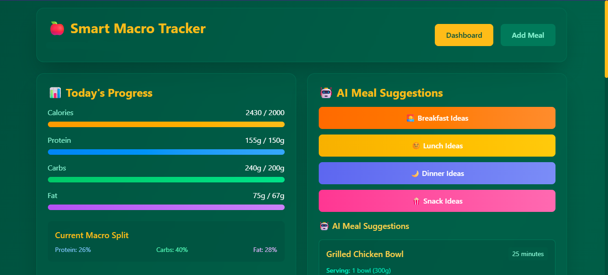

# 🧠 Smart Calorie Tracker with Meal Suggestions using AI

A smart, AI-powered calorie and macro tracker that not only logs your food intake but also provides **personalized meal suggestions** based on your remaining daily calories and macronutrient goals. Built with a focus on usability, customization, and real-time feedback, this tool is perfect for anyone looking to track their nutrition and make informed eating decisions.

 <!-- Add your screenshot image here -->

---

## ✨ Features

- 📝 **Calorie & Macro Tracking**  
  Log your meals and automatically calculate calories, protein, fats, and carbohydrates.

- 🧮 **AI Meal Suggestions**  
  Get dynamic meal recommendations based on the delta between your goal and current intake.

- 🍽️ **Meal Preferences & History**  
  Customize dietary preferences (e.g., vegetarian, high protein) and reuse frequent meals.

- 📊 **Interactive Dashboards**  
  Visualize your intake through clean, intuitive charts:
  - Calories vs. Goal
  - Macro Breakdown (Pie & Bar Charts)
  - Weekly Trends

- 🎯 **Goal-Based Recommendations**  
  Set daily targets (fat loss, muscle gain, maintenance) and receive AI-driven food suggestions accordingly.

- ⚙️ **Fully Customizable in Google Sheets**  
  Clone and personalize the tracker to fit your specific needs.

---

## 🚀 Getting Started

### 1. Clone the Repository

```bash
git clone https://github.com/garvgulati/Smart-Calorie-Tracker-with-Meal-Suggestions-using-AI.git
cd Smart-Calorie-Tracker-with-Meal-Suggestions-using-AI

